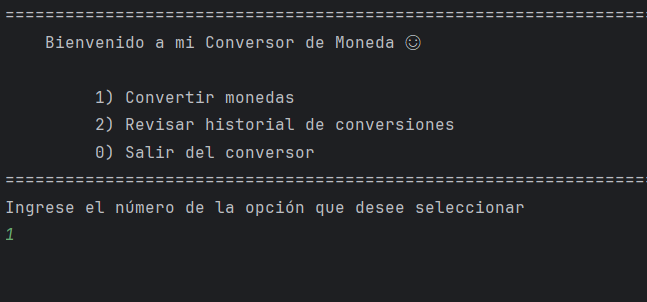
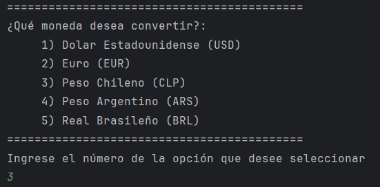
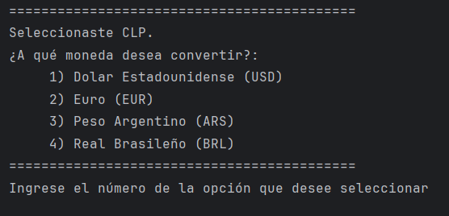
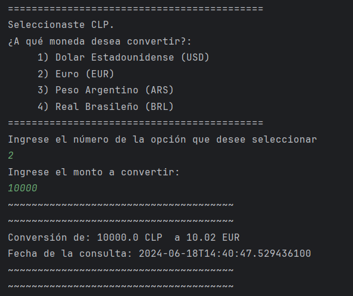
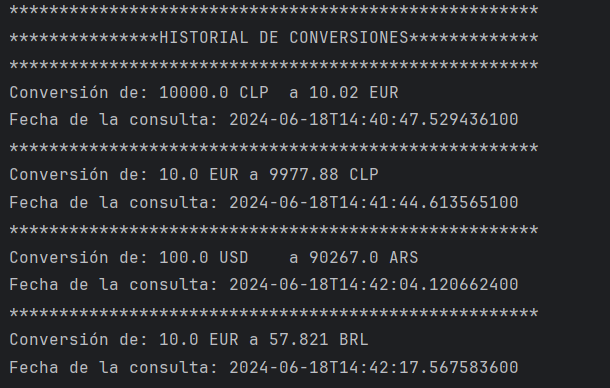

# Challenge Conversor de Monedas

Este proyecto consiste en la implementación de un conversor de monedas basado en Java, y es mi solución al desafio propuesto por el bootcamp Oracle Next Education impartido por Alura Latam en su formación de desarrollo back-end. 

## Caracteristicas del sistema

* Interacción con el usuario mediante una interfaz en la linea de comandos 
* Convierte los siguientes tipos de monedas: 
    * Dolar Estadounidense (USD)
    * Euro (EUR)
    * Peso Chileno (CLP)
    * Peso Argentino (ARS)
    * Real Brasileño (BRL)

  (La conversión puede ser entre cualquiera de las monedas anteriores)
* Las tasas de cambio se consiguen mediante la API [ExchangeRate-API](https://www.exchangerate-api.com/)
* Se pueden revisar las consultas hechas en un historial de consultas

## Demostración de uso:

* **Menu principal:**

* **Al seleccionar 1) Convertir monedas se imprime el siguiente menu:**

* **Aqui se puede seleccionar alguna de las monedas anteriores, para convertir por alguna de las otras divisas:**

* **Una vez seleccionadas ambos tipos de moneda, se pregunta el monto a convertir, y se entrega el resultado.**

* **Al seleccionar 2) Revisar historial de conversiones  en el menu principal, se pueden observar las consultas que se hicieron durante la ejecución.**

### Dependencias:

Para desarrollar este proyecto se utilizó [Gson](https://mvnrepository.com/artifact/com.google.code.gson/gson).

